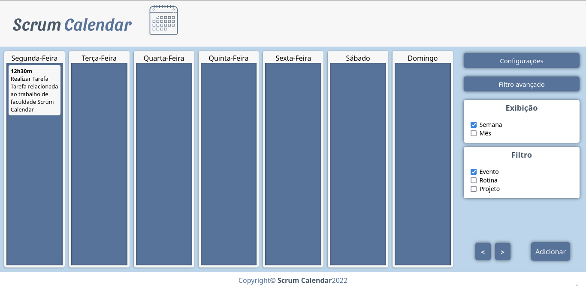
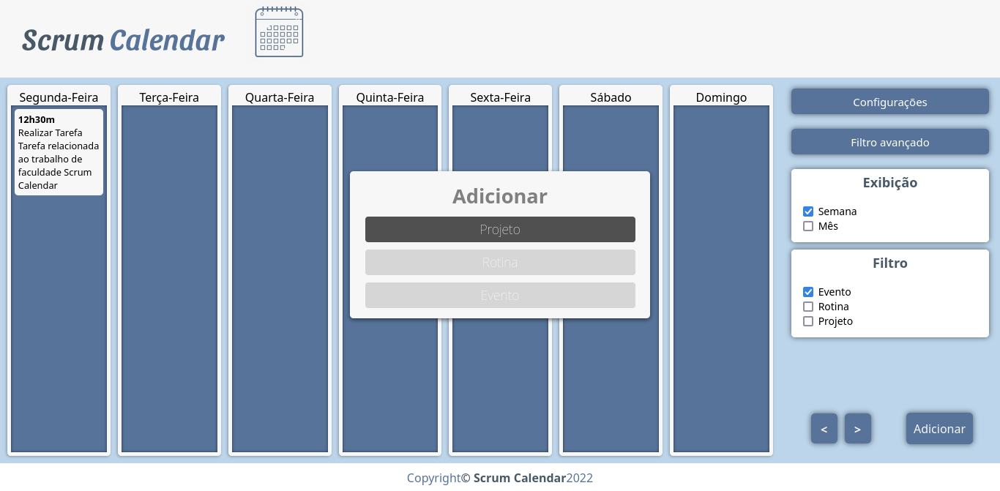
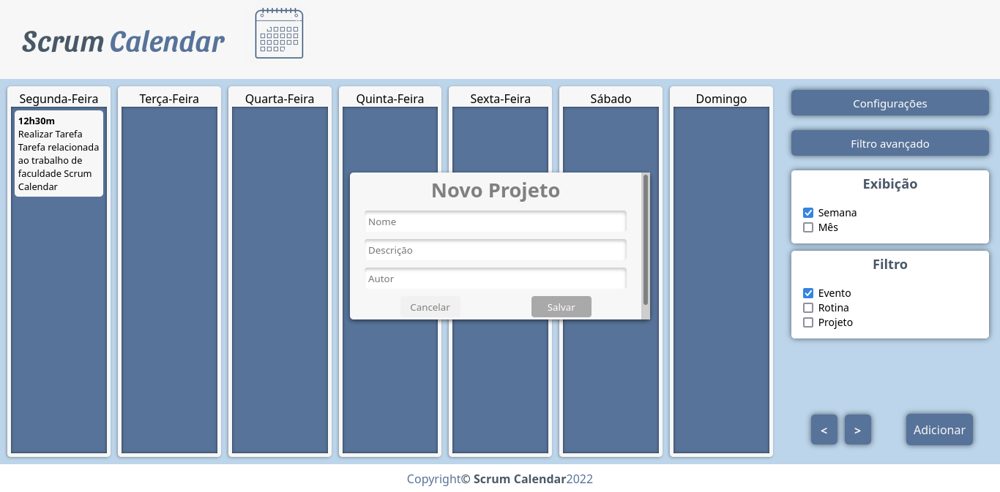
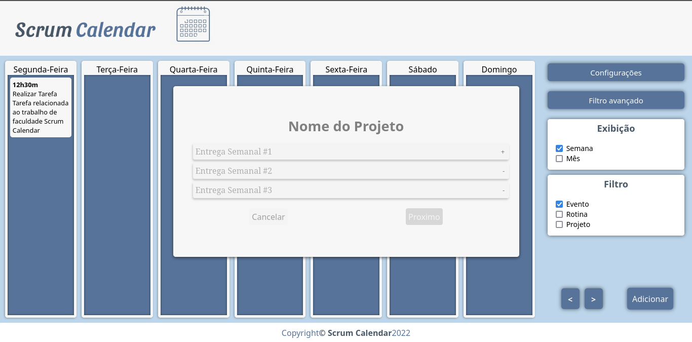

# Programação de Funcionalidades

Foram implementadas algumas funcionalidades relativas a descrição e funcionamento visual do sistema. As implementações foram feitas usando HTML e CSS e atendem às especificações feitas nos documentos de interface e template. 

** Algumas funcionalidades que dependem da utilização de javascript ainda não foram implementadas, tais como o uso dos formulários como templates para outros formulários, onde os títulos e botões são alterados via javascript.

## Interface (HTML/CSS)

Tela Inicial, de onde se dispõe o calendário e o menu lateral.

Ao clicar no botão Adicionar, será exibida a tela para escolher qual item será adicionado.

Nesta tela serão preenchidos os dados basicos do projeto.

Nesta tela serão separadas as entregas semanais do projeto.