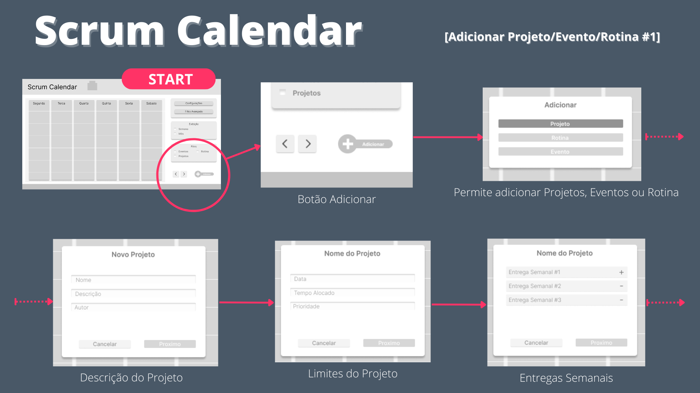
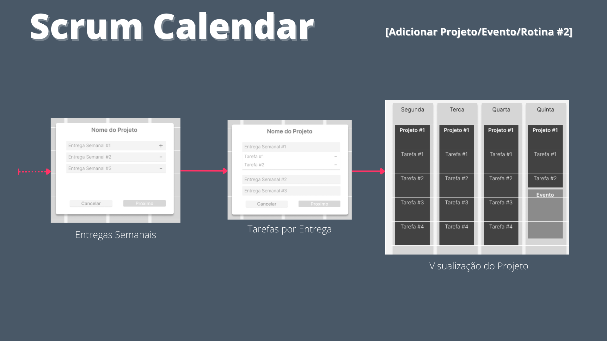
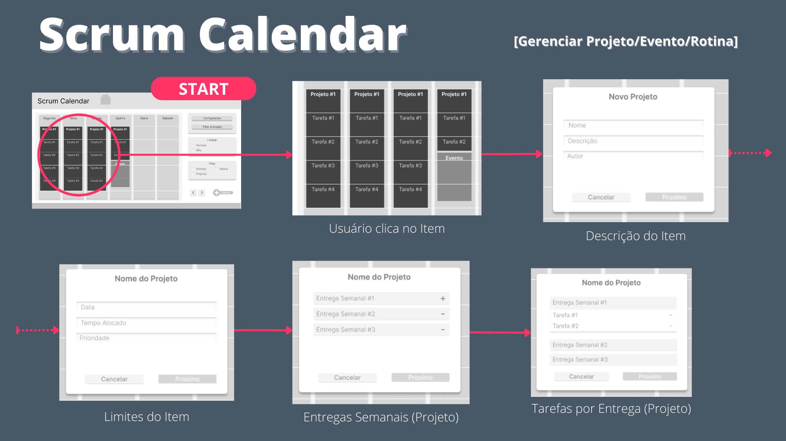
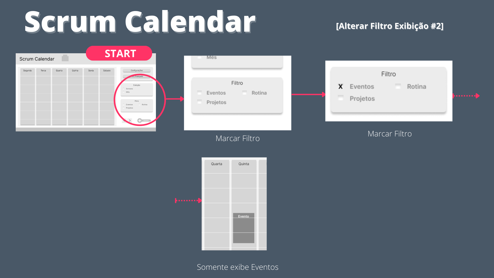
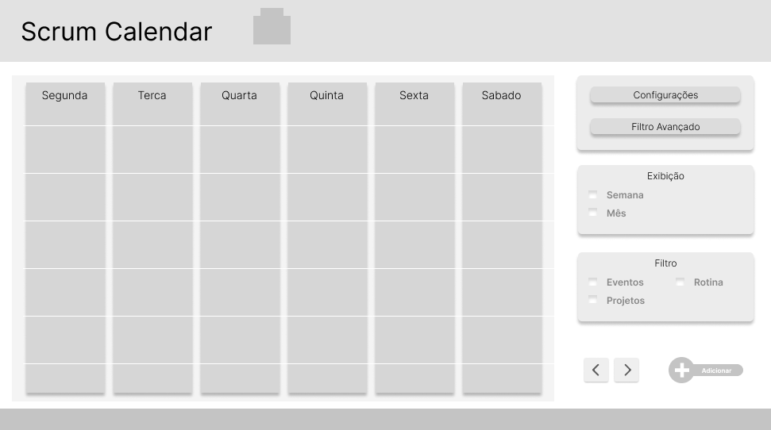
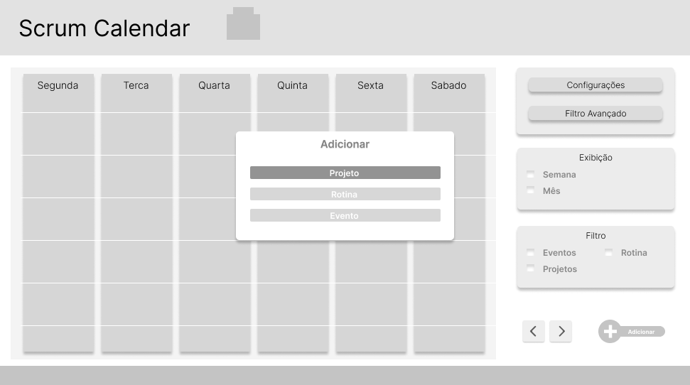
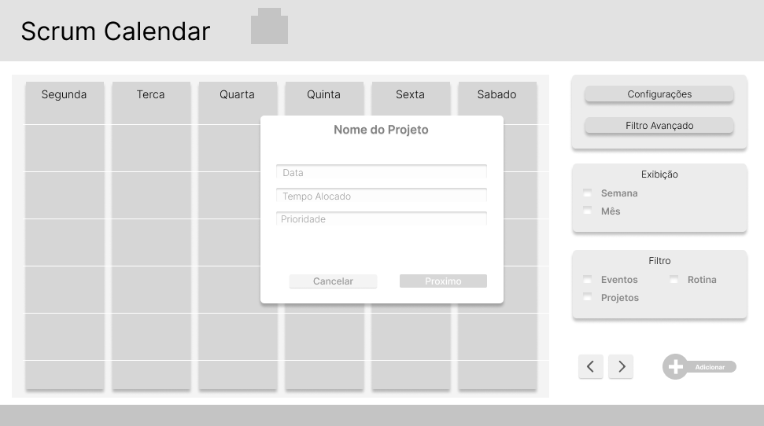
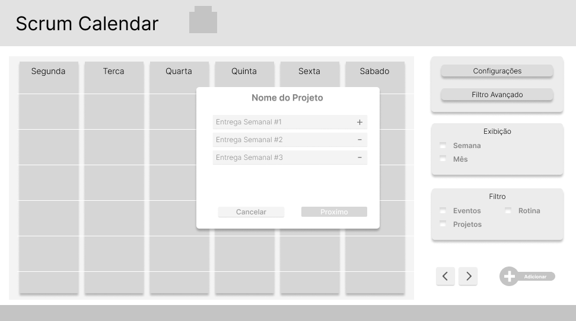
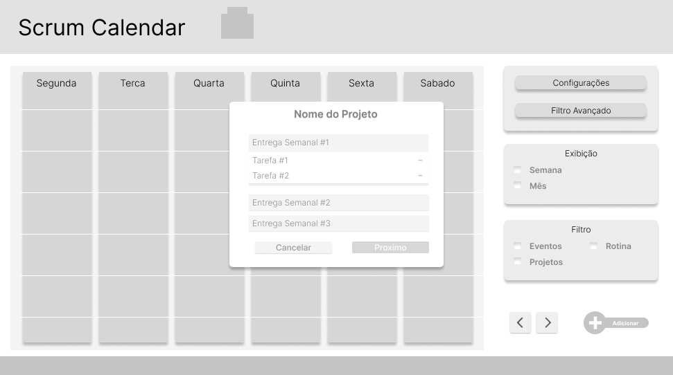
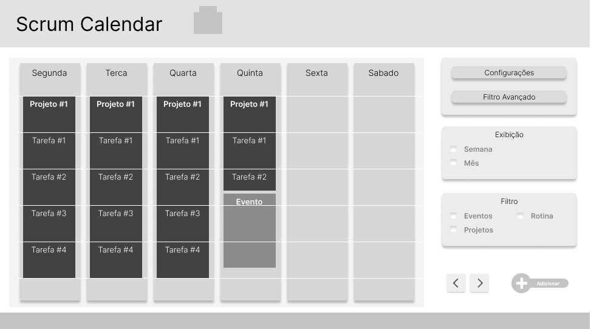

# Projeto de Interface

Visão geral da interação do usuário pelas telas do sistema e protótipo interativo das telas com as funcionalidades que fazem parte do sistema (wireframes).

 

## User Flow
São todas as telas que ilustram as histórias de usuário 

## Wireframes

Os wireframes seguintes descrevem as telas que serão usadas pelo sistema, em itens como adição/edição de projetos.

