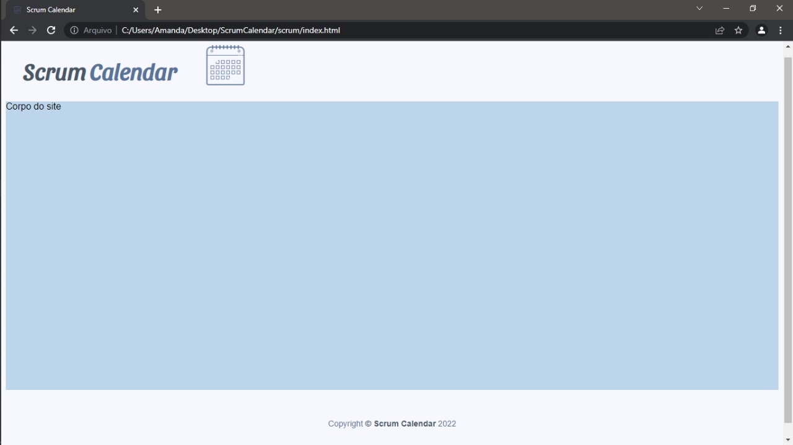

# Template padrão do site

O Template está disponível no repositório público da PUC. Sendo assim, segue o link do código em HTML e CSS onde se encontra o template com a logo e a iconografia.

https://github.com/ICEI-PUC-Minas-PMV-SI/TemplateBody
